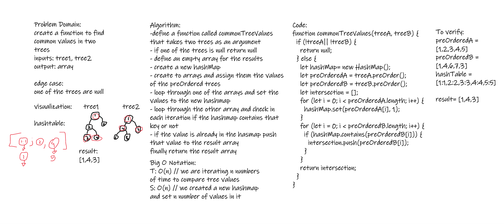
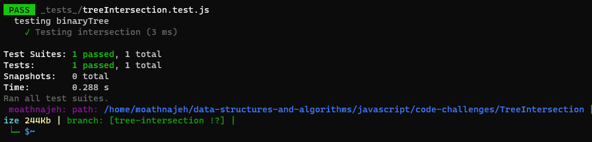

# Challenge Summary

create a function to find common values in two trees
inputs: tree1, tree2
output: array

## Whiteboard Process

## Approach & Efficiency

- T:O(n) --> we are iterating throught an array
- S:O(n) --> we created an array of length n
