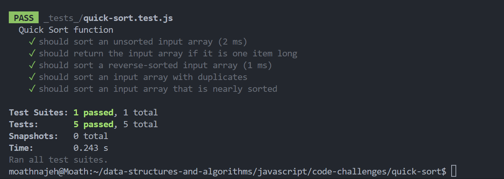

# Quick Sort Blog

```
ALGORITHM QuickSort(arr, left, right)
    if left < right
        // Partition the array by setting the position of the pivot value 
        DEFINE position <-- Partition(arr, left, right)
        // Sort the left
        QuickSort(arr, left, position - 1)
        // Sort the right
        QuickSort(arr, position + 1, right)

ALGORITHM Partition(arr, left, right)
    // set a pivot value as a point of reference
    DEFINE pivot <-- arr[right]
    // create a variable to track the largest index of numbers lower than the defined pivot
    DEFINE low <-- left - 1
    for i <- left to right do
        if arr[i] <= pivot
            low++
            Swap(arr, i, low)

     // place the value of the pivot location in the middle.
     // all numbers smaller than the pivot are on the left, larger on the right. 
     Swap(arr, right, low + 1)
    // return the pivot index point
     return low + 1

ALGORITHM Swap(arr, i, low)
    DEFINE temp;
    temp <-- arr[i]
    arr[i] <-- arr[low]
    arr[low] <-- temp
```
We will work with this input: 
```
arr = [8,4,23,42,16,15]
left = 0
right = 5
```

When we start, left is less than right and we enter the if statement. We will set position to the return value of Partition.

We enter Partition with the same arguments, and assign `pivot` to `arr[right]` and `left - 1` to `low`
```
arr = [8,4,23,42,16,15]
left = 0
right = 5
pivot = 15
low = -1
i = 0
```
We now start a for loop going from `left` to `right`. `arr[i]` is less than `pivot`, so we increase low and go to Swap.
```
arr = [8,4,23,42,16,15]
left = 0
right = 5
pivot = 15
low = 0
i = 0
Swap([8,4,23,42,16,15], 0, 0)
```
In Swap:
```
temp = 8;
arr[0] = 8;
arr[0] = 8;
```
So nothing changes so far. We go back up to the for loop in Partition, and i increases. 
```
arr = [8,4,23,42,16,15]
left = 0
right = 5
pivot = 15
low = 1
i = 1
Swap([8,4,23,42,16,15], 1, 1)
```
The same thing happens again, but this next time i increases, and we will not get into the if statement or do the swap.
```
arr = [8,4,23,42,16,15]
left = 0
right = 5
pivot = 15
low = 1
i = 2
```
Skip through the for loop while nothing else happens >>
On the last itereation, we go back in the if statement
```
arr = [8,4,23,42,16,15]
left = 0
right = 5
pivot = 15
low = 1
i = 4
```

We then swap the right(15) and the low + 1(23) so the array becomes:
```
[8,4,15,42,16,23]
```
And we return the `low + 1` which is 2, which becomes the position up in the QuickSort function:
```
arr = [8,4,15,42,16,23]
position = 2
left = 0
right = 5
```
We will call Quicksort now with the following:
```
arr = [8,4,15,23,16,42]
left = 0
right = 1
```
We go with this to Partition to find the new pivot value
```
arr = [8,4,15,23,16,42]
left = 0
right = 1
pivot = 4
low = -1
i = 0
```
Through the for loop, we make no swaps, and low does not increase
```
low = -1
```
We swap `low + 1`(8) and `right`(4) and the array becomes:
`[4,8,15,23,16,42]` and we return 0 as the position
```
arr = [4,8,15,23,16,42]
left = 0
right = 2
position 0
``` 
And we quicksort the new left with this array: 
```
arr = [4,8,15,23,16,42]`
left = 0
right = -1
``` 
Since left is greater than right, we now do a quicksort on the right
```
arr = [4,8,15,23,16,42]`
left = 1
right = 1
```
# The Right Side - Line 8 of original function
And again we exit. We leap up to the original right, now that the left is sorted.
```
arr = [4,8,15,23,16,42]`
left = 3
right = 5 
```
We enter Partition:
```
arr = [4,8,15,23,16,42]
left = 3
right = 5
pivot = 42
low = 4
```
We end up with a low of 4, the array does not change, and we return 5 as position
```
arr = [4,8,15,23,16,42]`
left = 3
right = 5
position = 5
```
Then we do quicksort with this:
```
arr = [4,8,15,23,16,42]`
left = 3
right = 4 
```
When we get out of the for loop, `low` = 2, never changing, and the array stays the same. We swap arr[`right`] (16) and arr[`low + 1`] (23) and the array will be `[4,8,15,16,23,42]`

Now we return 3, and go back up to the right side sort of the right side. The position of 5 + 1 is higher than right, so the algorithm is finally done, and it is sorted.


