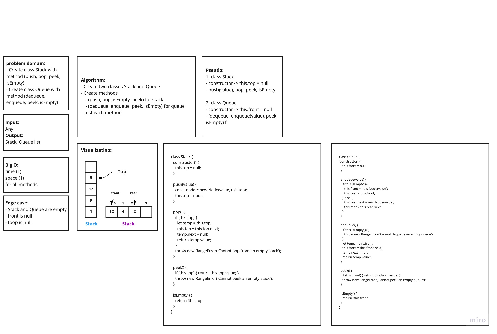

# Stacks and Queues
stack and queue is a data strurcture data container and it more efficient to store values in large project

## Challenge
Create a node
Create a Stack class that has a top property. It creates an empty Stack when instantiated and
Create a Queue class that has a front property. It creates an empty Queue when instantiated.

## Approach & Efficiency
The Big O(1) for peek and isempty
and the 0(n) for push , pop , enqueue , dequeue

## Stack:
* push: adds a new node with that value to the top of the stack 
* pop: Removes the node from the top of the stack
* peek: Returns: Value of the node located at the top of the stack
* isEmpty: Returns: Boolean indicating whether or not the stack is empty.

**Queue**
* enqueue: adds a new node with that value to the back of the queue 
* dequeue: Returns: the value from node from the front of the queue, removes the node from the front of the queue and should raise exception when called on empty queue.
* peek: Returns: Value of the node located at the top of the stack
* isEmpty: Returns: Boolean indicating whether or not the stack is empty.

## Whiteboard:

## Tests:
