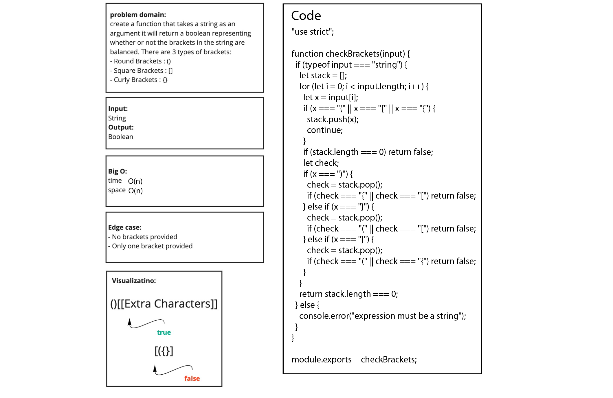

# stack-queue-brackets

## Challenge

- Write a function called validate brackets
  - Arguments: string
  - Return: boolean
    - representing whether or not the brackets in the string are balanced
- There are 3 types of brackets:
  - Round Brackets : ()
  - Square Brackets : []
  - Curly Brackets : {}

## WhiteBoard proccess

## Approach & Efficiency

- time complexity O(n)
- space complexity O(n)

## API

- function takes a string input and returns false if the brackets are not balanced and true if the brackets are balanced.
- if the argument was not a string it will show an error inside the console log.
